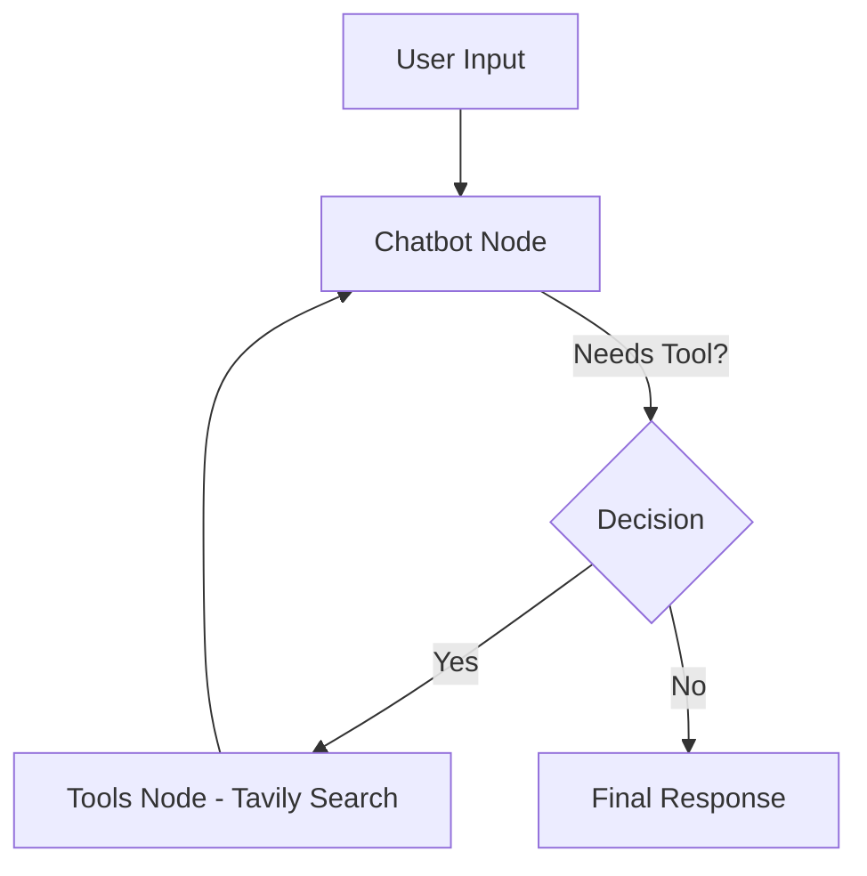
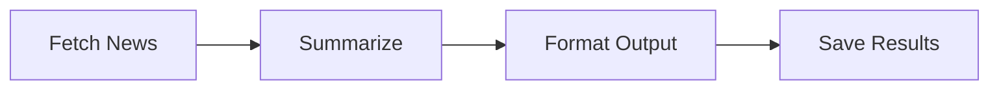

##  LangGraph Agentic AI System (Stateful Multi-Agent Chatbot)

> A production-ready **Stateful Agentic AI system** built using LangGraph, capable of reasoning, tool usage, and multi-step decision-making.

---

## 🎯 Why This Project Matters (Recruiter POV)

Most AI projects:

* ❌ Stateless (no memory)
* ❌ Just API wrappers
* ❌ No real-world workflow

This project demonstrates:

✅ Stateful reasoning
✅ Tool-augmented intelligence
✅ Modular AI architecture
✅ End-to-end deployment

👉 Exactly what modern AI roles demand.

---

## 🧠 System Architecture (High-Level)


### 🔹 Core Idea

Instead of linear pipelines → we use a **Graph-based execution model**

---

## 🔁 Agentic Workflow (LangGraph)



---

## 🧩 System Components

### 1️⃣ Chatbot Node

* Handles reasoning
* Decides whether to call tools

### 2️⃣ Tools Node

* Executes real-world actions
* Example: Tavily Search API

### 3️⃣ Graph Builder

* Defines:

  * Nodes
  * Edges
  * Conditional routing

---

## 🔄 Execution Flow

```text
START → Chatbot → (Tool Decision)
        → Tool → Chatbot → Response → END
```

---

## 🧠 Use Cases Implemented

### 💬 1. Basic Chatbot

* Simple LLM interaction
* Stateless baseline

---

### 🌐 2. Web-Enabled Agent (Real AI System)

* Uses Tavily Search
* Dynamic decision making
* Multi-step reasoning

---

### 📰 3. AI News Generator



---

## 🏗️ Project Structure

```bash
src/
│
├── graph/
│   └── graph_builder.py
│
├── nodes/
│   ├── chatbot_node.py
│   ├── tools_node.py
│   └── ai_news_node.py
│
├── tools/
│   └── search_tool.py
│
├── LLMS/
│   └── groq_llm.py
│
├── ui/
│   └── streamlit_app.py
```

---

## ⚙️ Tech Stack

| Layer         | Tech           |
| ------------- | -------------- |
| Orchestration | LangGraph      |
| LLM           | Groq (Llama 3) |
| Tools         | Tavily API     |
| UI            | Streamlit      |
| Vector DB     | FAISS          |
| Language      | Python         |

---

## ⚡ Key Features

* 🔁 Stateful conversation memory
* 🧠 Autonomous tool selection
* ⚡ Streaming responses
* 📡 Real-time web search
* 🧩 Modular architecture

---

## 🚀 Deployment

* Platform: **Streamlit Cloud / Hugging Face Spaces**
* Environment-based API handling
* Production-ready structure

---

## 🔐 Environment Variables

```bash
GROQ_API_KEY=your_key
TAVILY_API_KEY=your_key
```

---

## ▶️ Run Locally

```bash
git clone https://github.com/Nihal108-bi/Langgraph-Chatbot
cd langgraph-chatbot
pip install -r requirements.txt
streamlit run app.py
```

---

## 🧠 Learning Outcome (From PDF Insight)

According to your project brief :

* Stateful Graph Design
* Tool-based reasoning
* Modular AI system design
* Real-world deployment

